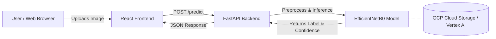

# PixelTruth

> **Detecting AI-generated images vs. real photographs using deep learning**


## 📖 Overview

PixelTruth is an end-to-end deep learning application designed to distinguish between authentic photographs and AI-generated imagery. As generative AI models (like Midjourney, DALL-E, and Stable Diffusion) become increasingly sophisticated, detecting synthetic media is crucial for digital authenticity, journalism, and misinformation mitigation. 

The system leverages a fine-tuned EfficientNetB0 architecture built with TensorFlow/Keras. The inference engine is served via a blazing-fast FastAPI backend, and the application is presented through a highly interactive, retro-inspired React frontend.

### ✨ Key Features
- **High-Accuracy Classification**: Uses a state-of-the-art Convolutional Neural Network (CNN) specifically optimized for detecting spatial frequency artifacts common in generative models.
- **Retro Terminal UI**: A highly stylized, skeuomorphic "1-bit" design aesthetic referencing classic desktop operating systems.
- **FastAPI Inference Engine**: Asynchronous, highly concurrent Python backend for low-latency image processing.
- **Persistent Scan History**: Local caching of previous scans so users can track their results over time.
- **Drag-and-Drop Image Support**: Seamless UX for testing local images.

---

## 🧠 Model Architecture & Training

PixelTruth relies on **EfficientNetB0** — chosen for its excellent balance of parameter efficiency and high classification accuracy. 

### Why EfficientNet?
Generative models often leave subtle, microscopic grid-like artifacts in the frequency domain of images (due to upsampling layers in CNN-based GANs and diffusion processes). EfficientNet's compound scaling algorithm captures these fine-grained structural anomalies better than standard ResNet architectures, without requiring massive computational overhead during inference.

### Training Pipeline
1. **Transfer Learning**: We initialize the model with weights pre-trained on ImageNet.
2. **Feature Extraction**: The base layers are frozen, and a custom dense classification head is trained to distinguish `REAL` vs `FAKE`.
3. **Fine-Tuning**: The top layers of the EfficientNet base are unblocked and trained with a very low learning rate to adapt the spatial filters specifically to digital synthetic artifacts.
4. **Dataset**: Trained on the [CIFAKE dataset](https://www.kaggle.com/datasets/birdy654/cifake-real-and-ai-generated-synthetic-images), consisting of authentic photographs and AI-generated equivalents.

---

## 🏗️ System Architecture



### Tech Stack
- **Model & Deep Learning**: TensorFlow / Keras (EfficientNetB0)
- **Backend API**: FastAPI, Uvicorn, Python, python-multipart
- **Frontend**: React, Tailwind CSS, Vite
- **Cloud & MLOps**: Google Cloud Platform (Vertex AI, Cloud Storage, Cloud Run, Firebase Hosting)

---

## 📂 Project Structure

```text
PixelTruth/
├── backend/
│   ├── app/
│   │   ├── main.py          # FastAPI application & endpoints
│   │   ├── model_loader.py  # Model inference & image preprocessing
│   │   └── schemas.py       # Pydantic data schemas
│   ├── requirements.txt
│   └── Dockerfile
├── frontend/
│   ├── src/
│   │   ├── App.jsx          # React UI components, API hooks, & state
│   │   ├── index.css        # Custom retro styles & Tailwind configurations
│   │   └── main.jsx
│   ├── index.html
│   └── package.json
├── models/                  # Local .keras model artifacts (gitignored)
├── data/                    # Dataset directory (gitignored)
├── docs/                    # Screenshots & documentation assets
└── README.md
```

---

## 🔌 API Reference

The backend exposes a simple, robust REST API for integrating the classifier into other tools.

### `GET /health`
Checks if the inference server is online and the model is successfully loaded in memory.
**Response (200 OK):**
```json
{
  "status": "ok",
  "model_loaded": true
}
```

### `POST /predict`
Analyzes an image and returns the classification.
- **Headers:** `Content-Type: multipart/form-data`
- **Body:** `file` (UploadFile) - The image to scan. Max size 10MB. Accepted formats: `.jpg, .jpeg, .png, .webp`.

**Response (200 OK):**
```json
{
  "label": "FAKE",
  "confidence": 0.9842
}
```

---

## 🚀 Setup & Running Locally

### Prerequisites
- Python 3.9+
- Node.js 18+ and npm

### 1. Clone Repository
```bash
git clone https://github.com/anshul1058/Pixel-truth.git
cd "Pixel truth"
```

### 2. Backend Setup
```bash
cd backend
python3 -m venv venv
source venv/bin/activate
pip install -r requirements.txt
uvicorn app.main:app --reload --port 8000
```
The FastAPI server will be available at `http://localhost:8000`. You can view the interactive API docs at `http://localhost:8000/docs`.

### 3. Frontend Setup
In a new terminal:
```bash
cd frontend
npm install
npm run dev
```
The React development server will start at `http://localhost:5173`.

---

## ⚠️ Known Limitations

- **Dataset Constraints**: The current baseline model is trained on the CIFAKE dataset, which uses CIFAR-10 ($32 \times 32$ upscaled images) for the real class. Consequently, the model may exhibit lower accuracy on high-resolution real-world photographs since it was not exposed to high-res real camera samples during initial training.
- **Baseline Subset**: The baseline model was currently trained on a small subset (500 images per class) to validate the end-to-end pipeline. Full-scale training on the complete dataset (~70,000 images per class) via Vertex AI is in progress.
- **Generator Generalization**: Generalization to newer diffusion models or generative architectures not present in the training set (e.g., Midjourney v6, FLUX) is currently untested and may show weaker performance.
- **Adversarial Robustness**: No formal testing against adversarial attacks, compression perturbations, or anti-forensic filtering has been conducted yet.

---

## 🗺️ Roadmap

- [ ] **Full-Scale Vertex AI Training**: Train the model on the full CIFAKE dataset (~140k images total) using GCP Vertex AI compute clusters.
- [ ] **Cloud Deployment**: Containerize and deploy the FastAPI backend to Google Cloud Run, and host the frontend globally on Firebase Hosting.
- [ ] **Enhanced Dataset**: Incorporate diverse, high-resolution real-world datasets (e.g., ImageNet, COCO) alongside modern diffusion model outputs.
- [ ] **Frequency Domain Analysis**: Integrate FFT / DCT spectral features directly into the preprocessing pipeline to capture high-frequency grid artifacts typical of modern generators.
- [ ] **Model Monitoring**: Set up prediction drift monitoring and feedback loops in production to continually evaluate accuracy against new AI generators.

---

## 📄 License

Distributed under the MIT License. See `LICENSE` for more information.
