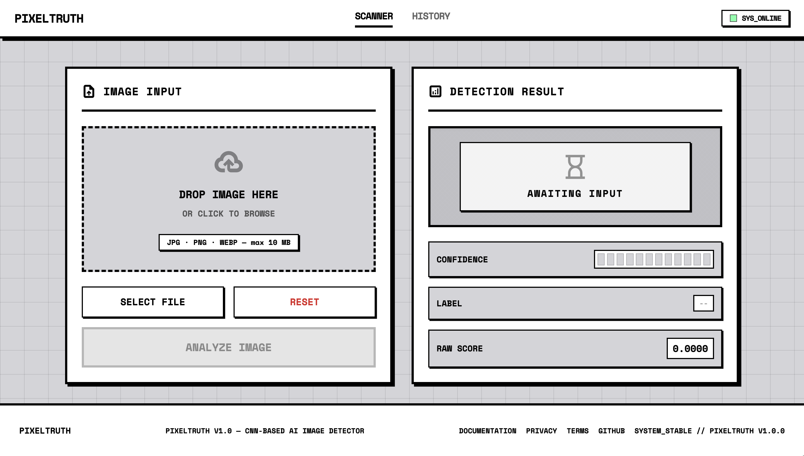

# PixelTruth

Detecting AI-generated images vs. real photographs using deep learning.

## Overview

PixelTruth is a binary image classifier that distinguishes AI-generated images from real photographs. Built end-to-end — data collection, preprocessing, model training, a FastAPI backend, and a React frontend — as a hands-on exploration of the practical engineering challenges in AI-content detection, a real and growing problem as generative models become harder to distinguish from reality.

**Tech stack:** SigLIP2 + DINOv2 ensemble (PyTorch), FastAPI, React 19, Vite 8, Tailwind CSS.

## Architecture

```
┌─────────────┐      ┌──────────────┐      ┌─────────────────────────┐
│   React     │─────▶│   FastAPI    │─────▶│  Ensemble Model         │
│  Frontend   │◀─────│   Backend    │◀─────│  (SigLIP2 + DINOv2)     │
└─────────────┘      └──────────────┘      └─────────────────────────┘
                            │
                            ▼
                   ┌──────────────────┐
                   │  HuggingFace Hub  │
                   │  (model weights)  │
                   └──────────────────┘
```

## How It Works

1. An image is uploaded through the React frontend (drag-and-drop or click-to-browse).
2. The FastAPI backend validates the file (JPEG/PNG/WEBP, max 10MB) and sends it to the model.
3. The **EnsembleAIDetector** processes the image through two vision backbones:
   - **SigLIP2** (google/siglip2-so400m-patch14-384) — vision-language model features
   - **DINOv2** (vit_large_patch14_dinov2.lvd142m) — self-supervised vision features
4. Features from both backbones are concatenated and fed to a classification head.
5. The model outputs a sigmoid score; scores above 0.5 are classified `ai-generated`, below `real`.
6. The label and confidence score are returned as JSON and displayed in the UI.

## Tech Stack

| Layer | Technology |
|---|---|
| **Model** | SigLIP2 + DINOv2 ensemble with LoRA adapters (PyTorch) |
| **Backend** | FastAPI, Uvicorn, Python |
| **Frontend** | React 19, Vite 8, Tailwind CSS (CDN) |
| **ML Framework** | PyTorch, torchvision, timm, transformers, PEFT |
| **Model Hosting** | HuggingFace Hub (`Bombek1/ai-image-detector-siglip-dinov2`) |
| **Cloud (planned)** | Google Cloud (Vertex AI, Cloud Run, Firebase Hosting) |

## Project Structure

```
pixel-truth/
├── backend/                # FastAPI backend
│   ├── app/
│   │   ├── main.py         # FastAPI app, CORS, /predict & /health endpoints
│   │   ├── model.py        # EnsembleAIDetector: SigLIP2 + DINOv2 + LoRA + ClassificationHead
│   │   ├── model_loader.py # Lazy model loading from HuggingFace Hub
│   │   └── schemas.py      # Pydantic response models
│   └── requirements.txt    # Backend Python dependencies
│
├── frontend/               # React app
│   ├── src/
│   │   ├── App.jsx         # Full single-page app (Scanner, History, upload, analyze)
│   │   ├── main.jsx        # React entry point
│   │   └── index.css       # Tailwind directives, grid-bg, body styles
│   ├── index.html          # Entry HTML, Tailwind CDN, Space Mono font
│   └── package.json        # React 19, Vite 8, Oxlint
│
├── training/               # Data collection, preprocessing, training, evaluation
│   ├── fetch.py            # Downloads CIFAKE dataset
│   ├── fetch_extra_data.py # Downloads COCO real photos + DiffusionDB fakes
│   ├── fetch_midjourney.py # Downloads Midjourney-generated images
│   ├── generate_gemini_images.py  # Generates fake images via Gemini API
│   ├── preprocess.py       # Resize + train/val/test split (v1)
│   ├── combine_and_preprocess.py  # Multi-source combine, per-source balancing
│   ├── balance_dataset.py  # Equalizes per-generator count
│   ├── train.py            # Baseline EfficientNetB0 training
│   ├── train_v2.py         # EfficientNetB0 + 2-stage fine-tuning + JPEG augmentation
│   ├── train_improved.py   # EfficientNetB3, 3-stage training, advanced augmentations
│   ├── evaluate.py         # Overall test-set evaluation + per-source breakdown
│   └── evaluate_per_source.py  # Detailed per-generator-source evaluation
│
├── data/                   # Raw and processed datasets (gitignored)
├── models/                 # Trained model files (gitignored)
├── docs/                   # Screenshots and documentation assets
├── infra/                  # cloudbuild.yaml (placeholder)
├── .gitignore
├── LICENSE                 # MIT License
└── README.md
```

## Setup & Running Locally

### 1. Clone the repository

```bash
git clone https://github.com/anshul1058/Pixel-truth.git
cd Pixel-truth
```

### 2. Set up and run the backend

```bash
cd backend
python3 -m venv venv
source venv/bin/activate
pip install -r requirements.txt
uvicorn app.main:app --reload --host 0.0.0.0 --port 8000
```

The backend will download model weights from HuggingFace Hub on first run.

### 3. Set up and run the frontend

```bash
cd frontend
npm install
npm run dev
```

The frontend runs on `http://localhost:5173` by default.

### 4. Frontend Features

- **Scanner Tab**: Drag-and-drop or click-to-browse image upload (JPEG/PNG/WEBP, max 10MB). Displays result as REAL/FAKE label with confidence percentage and a visual bar graph.
- **History Tab**: Persistent scan history stored in localStorage (filename, date, result, confidence).
- **System Status**: Live green/red "SYS_ONLINE/SYS_OFFLINE" badge polling `/health`.
- **Footer**: Links to Documentation, Privacy Policy, Terms of Service (modal popups), and GitHub repo.

### Frontend Preview



## API Endpoints

| Method | Endpoint | Description |
|---|---|---|
| `GET` | `/health` | Returns server status and whether the model is loaded |
| `POST` | `/predict` | Accepts an image file upload, returns `{label, confidence}` |

### Example Response

```json
{
  "label": "real",
  "confidence": 0.9234
}
```

## Model Architecture

### EnsembleAIDetector

The model combines two powerful vision backbones:

**SigLIP2 (google/siglip2-so400m-patch14-384)**
- Vision-language model trained on large-scale image-text pairs
- Provides rich semantic features via `pooler_output`
- Fine-tuned with LoRA adapters on `q_proj` and `v_proj` layers

**DINOv2 (vit_large_patch14_dinov2.lvd142m)**
- Self-supervised vision transformer (ViT-Large)
- Provides structural/texture features
- Fine-tuned with custom LoRA adapter on `qkv` layer

**Classification Head**
```
LayerNorm(2048) → Linear(2048, 512) → GELU → Dropout(0.3)
→ Linear(512, 256) → GELU → Dropout(0.3) → Linear(256, 1)
```

Features from both backbones (2048-dim total) are concatenated and passed through the head for binary classification.

## Training Pipeline

### Data Collection (4+ generator families)

| Source | Type | Script |
|---|---|---|
| CIFAKE | GAN-generated fakes | `fetch.py` |
| COCO | Real photographs | `fetch_extra_data.py` |
| DiffusionDB | Stable Diffusion fakes | `fetch_extra_data.py` |
| Midjourney | Midjourney fakes | `fetch_midjourney.py` |
| Gemini | Google Gemini fakes | `generate_gemini_images.py` |

### Preprocessing

1. **Multi-source merge** (`combine_and_preprocess.py`): Combines all sources with per-source tagging, Gemini 4x oversampling in training split, per-source cap of 3,666 images.
2. **Balancing** (`balance_dataset.py`): Equalizes per-generator count to 2,000 images each.
3. **Split**: Stratified train/val/test split preserving source distribution.

### Training Evolution

| Version | Backbone | Resolution | Key Techniques | Accuracy |
|---|---|---|---|---|
| v1 | EfficientNetB0 | 224×224 | Frozen base, GAP + Dense(128) head | Baseline |
| v2 | EfficientNetB0 | 224×224 | JPEG augmentation, 2-stage fine-tuning | 98.27% |
| v3 | EfficientNetB3 | 384×384 | Mixed precision, 3-stage, MixUp, heavy augmentation | Best |

### Key Training Insights

- **Domain gap**: CIFAKE's "real" class was upscaled CIFAR-10, not real photos → replaced with COCO
- **Source balancing**: Without per-family balancing, CIFAKE's larger volume dominated → equalized per source
- **JPEG augmentation**: Added for robustness against real-world recompression (social media, messaging)
- **BatchNorm in inference mode** during frozen-base training

## Known Limitations

- **Trained on limited generator families.** Strong on GAN (CIFAKE) and diffusion (DiffusionDB/Stable Diffusion) fakes, but generalization to other generators (DALL-E, Imagen) is unverified.
- **No AI-detection model generalizes perfectly to unseen generators** — this is a documented open problem in this research area.
- **Dataset scale is modest by design** (~10k-15k images for fast iteration). Full-scale training (~70k+ images/class) via Vertex AI is planned.
- **No adversarial robustness testing** — the model hasn't been evaluated against adversarial inputs.

## Roadmap

- Add more generator families (DALL-E, Imagen, Flux) to training data
- Full-dataset training on Vertex AI
- Deploy backend to Cloud Run, frontend to Firebase Hosting
- Model monitoring for prediction drift
- Frequency-domain (FFT/DCT) feature augmentation
- Multi-class detection (identify which generator created the image)

## License

This project is licensed under the [MIT License](LICENSE).
